# X Mass Blocker — Visual Guide

A screenshot-by-screenshot walkthrough: installing the extension, opening it two different ways, touring every tab, and using it on Android.

**Choose your language / زبان خود را انتخاب کنید:**
[**English**](#english) | [**فارسی**](#فارسی)

> All screenshots below are real, taken directly from this extension running in Chrome — not mockups.

---

## English

### 1. Install the extension (desktop Chrome)

1. Download the extension's `.zip` file and extract it somewhere permanent (e.g. your Documents folder).
2. Open a new tab and go to `chrome://extensions`.
3. Turn on **Developer mode** using the toggle in the top-right corner.
4. Click **Load unpacked** and select the extracted folder.

The extension now appears in your list, with its own icon:

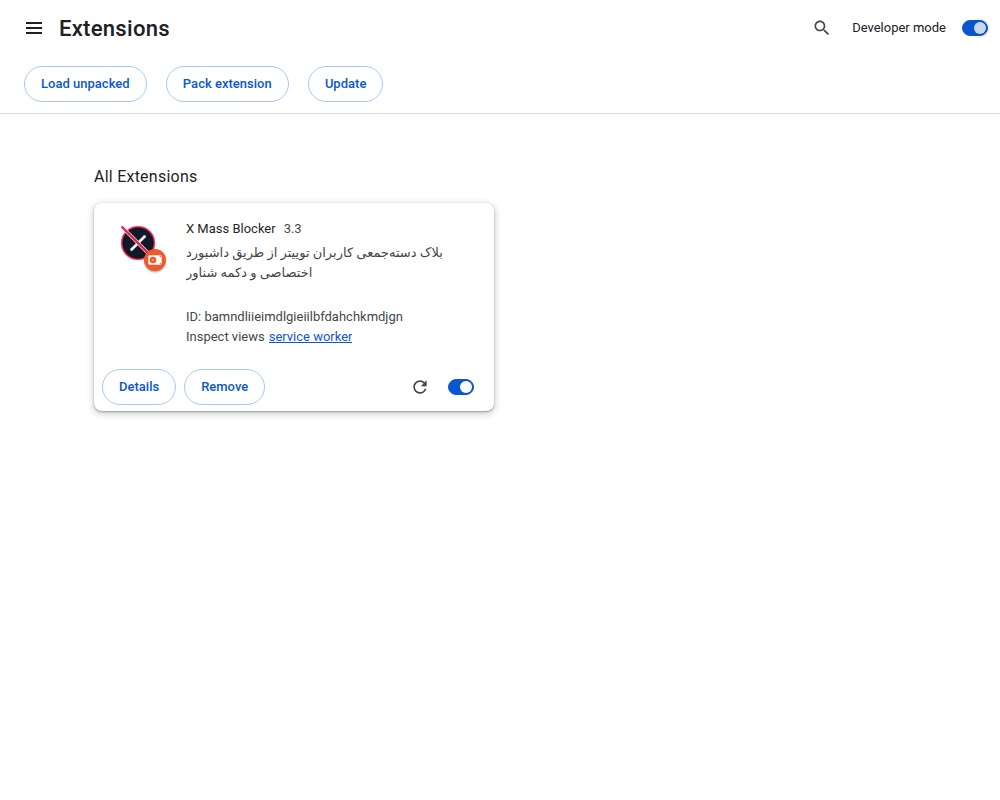

5. Click the puzzle-piece icon in Chrome's toolbar and **pin** X Mass Blocker so its icon stays visible.

### 2. Two ways to open it

**A. Click the toolbar icon → quick popup, right where you are**
This opens a small box in place — good for a quick paste-and-go job.

| Light | Dark |
|---|---|
| 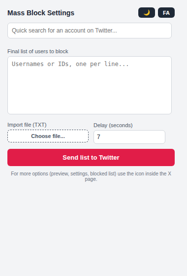 | 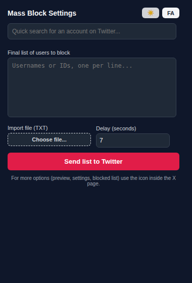 |

There's a 🌙/☀️ button to flip the theme, and an `EN`/`FA` button to flip the language, right in the popup.

**B. Click the round icon floating on the X page → full dashboard in a new tab**
While you're on x.com or twitter.com, a small round icon floats on the right edge of the page:

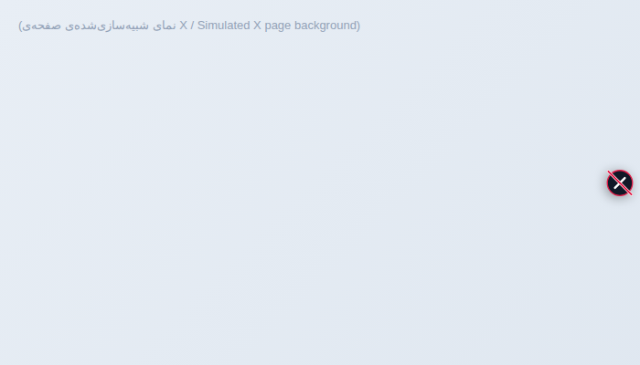

Clicking it opens the **full dashboard** in a new tab — this is where the rest of the tour below happens.

### 3. Touring the dashboard tabs

**Mass Block** — paste a list, choose username or numeric X ID mode, set a delay, preview, then start:

*Persian / light theme:*
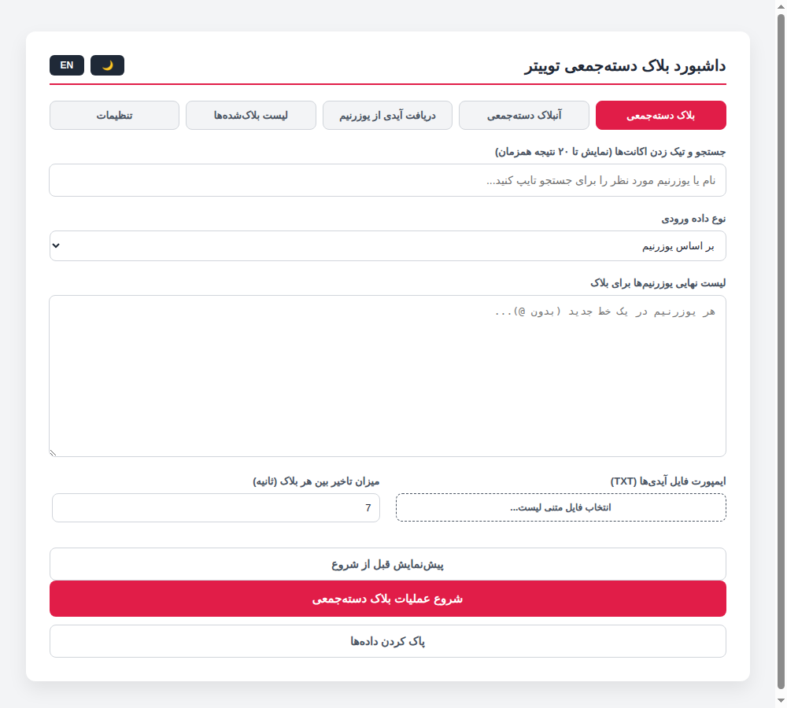

*English / light theme:*
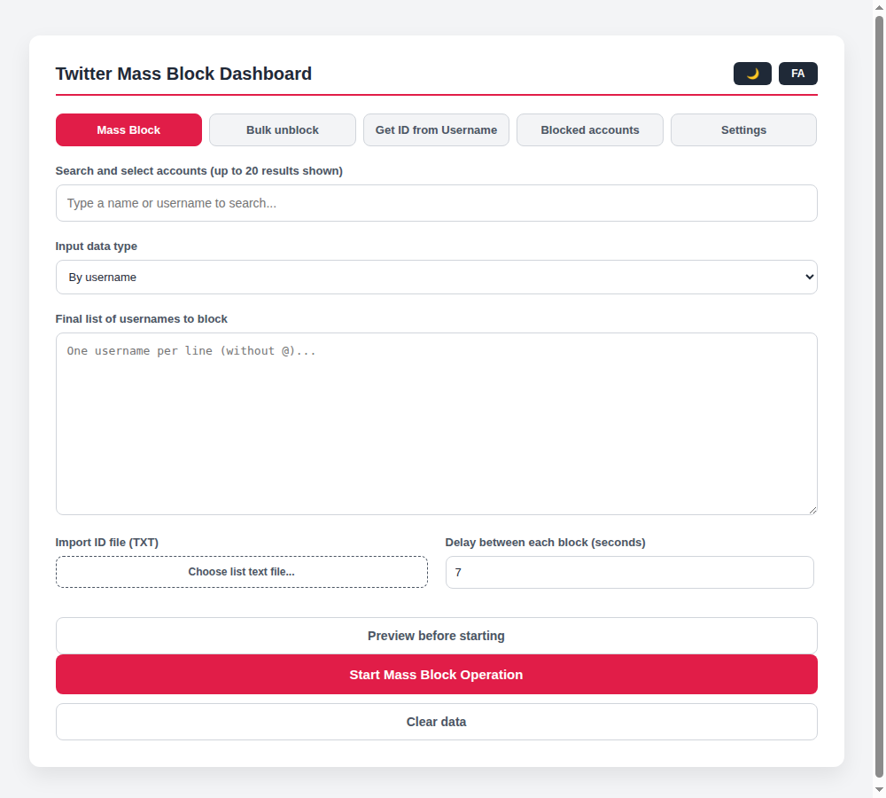

*English / dark theme:*
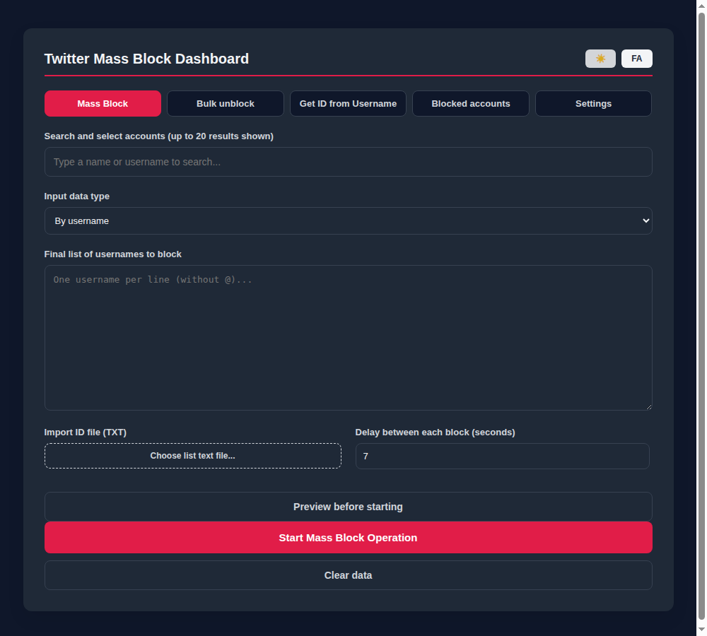

**Bulk Unblock** — same idea, in reverse:
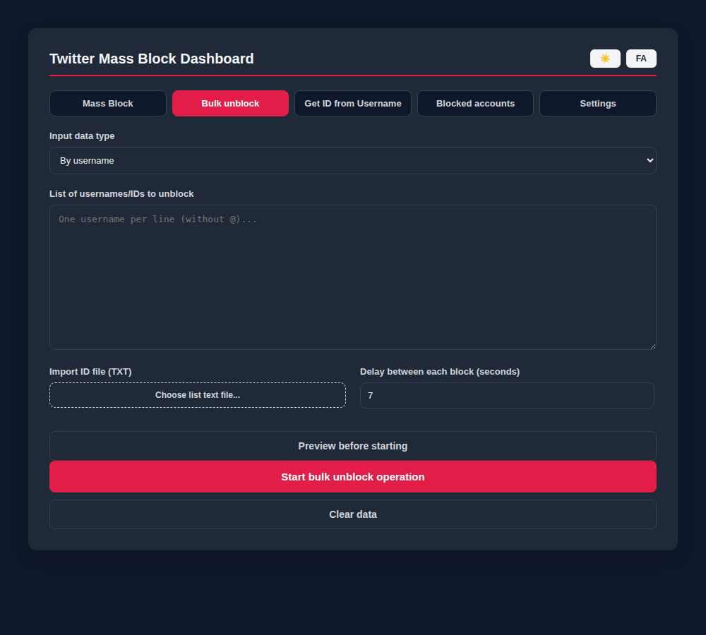

**ID Finder** — turn a username into its numeric X ID:
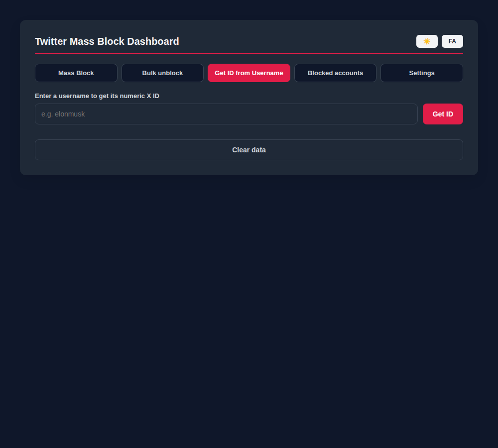

**Blocked Accounts** — fetch, search, sort, bulk-unblock, and export your full blocked list as CSV:
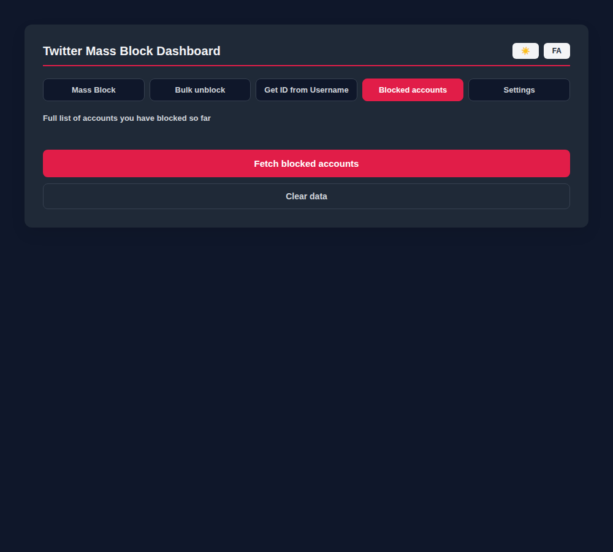

**Settings** — theme, resume-after-refresh behavior, safety warnings, whitelist:
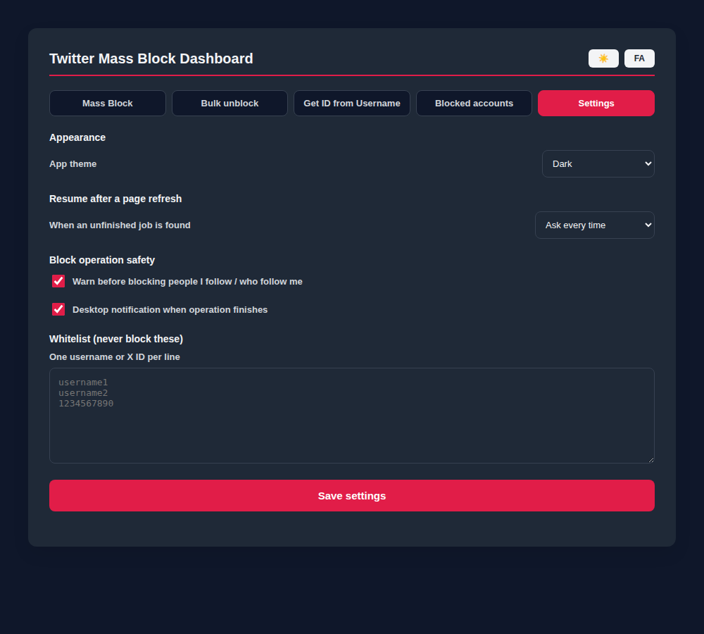

### 4. Using it on Android

Regular Chrome for Android does **not** support extensions at all — this is a Google restriction, not something this extension can work around. To run Chrome extensions on an Android phone, you need a browser built specifically to allow it, such as **Mises Browser** or **Kiwi Browser**.

1. Install **Mises Browser** (or Kiwi Browser) from the Google Play Store.
2. Download this extension's `.zip` file on your phone and extract it using any file manager app that supports "Extract/Unzip" (many Android file managers do this natively; if not, a free extractor app from the Play Store works).
3. Open Mises Browser, go into its menu and find **Extensions** (sometimes under a "More tools" or settings-style menu — the exact wording can vary slightly by app version).
4. Look for a **Developer mode** switch on that page and turn it on — this unlocks a **Load unpacked** option, the same way it works on desktop Chrome.
5. Tap **Load unpacked**, then use the folder picker to navigate to and select the folder you extracted in step 2.
6. The extension should now appear in the browser's extension list, with the ability to pin its icon to the toolbar, exactly like on desktop.

> ⚠️ Honesty note: I don't have an Android device or emulator to screenshot this flow myself, so the steps above are based on how Mises/Kiwi-style browsers document their extension support, not a screenshot I personally captured. The concept (Developer mode → Load unpacked → pick the folder) mirrors desktop Chrome closely, but exact menu names may differ a little depending on the app version you have installed.

---

## فارسی

### ۱. نصب افزونه (گوگل کروم روی کامپیوتر)

۱. فایل `.zip` افزونه رو دانلود کن و یه‌جای ثابت (مثلاً پوشه Documents) از حالت فشرده خارجش کن.
۲. یه تب جدید باز کن و برو به آدرس `chrome://extensions`.
۳. گزینه‌ی **Developer mode** رو از سوییچ بالا سمت راست روشن کن.
۴. روی **Load unpacked** بزن و پوشه‌ای که از حالت فشرده خارج کردی رو انتخاب کن.

الان افزونه با آیکون خودش تو لیست ظاهر میشه:

۵. روی آیکون قطعه‌پازلی تو نوار ابزار کروم بزن و افزونه X Mass Blocker رو **پین** کن تا همیشه قابل مشاهده باشه.

### ۲. دو راه برای باز کردنش

**الف. کلیک روی آیکون نوار ابزار ← باکس کوچیک، همون‌جا که هستی**
این یه باکس کوچیک همون لحظه باز می‌کنه - برای کارهای سریع خیلی مناسبه.

| روشن | تیره |
|---|---|
|  |  |

یه دکمه 🌙/☀️ برای عوض کردن تم، و یه دکمه EN/FA برای عوض کردن زبان، همون تو پاپ‌آپ هست.

**ب. کلیک روی آیکون گرد شناور داخل صفحه ایکس ← داشبورد کامل در تب جدید**
وقتی تو x.com یا twitter.com هستی، یه آیکون گرد کوچیک سمت راست صفحه شناوره:

با کلیک روش، **داشبورد کامل** تو یه تب جدید باز میشه - همون‌جایی که ادامه‌ی این تور رو می‌بینی.

### ۳. تور تب‌های داشبورد

**بلاک دسته‌جمعی** — یه لیست بده، حالت یوزرنیم یا X ID عددی رو انتخاب کن، تاخیر رو تنظیم کن، پیش‌نمایش بگیر، بعد شروع کن:

*فارسی / تم روشن:*

*انگلیسی / تم روشن:*

*انگلیسی / تم تیره:*

**آنبلاک دسته‌جمعی** — همون منطق، برعکس:

**دریافت آیدی از یوزرنیم** — یوزرنیم رو به آیدی عددی X ID تبدیل کن:

**لیست بلاک‌شده‌ها** — دریافت، جستجو، مرتب‌سازی، آنبلاک گروهی، و خروجی CSV از کل لیست بلاک‌هات:

**تنظیمات** — تم، رفتار ازسرگیری بعد از رفرش، هشدارهای ایمنی، لیست استثنا:

### ۴. استفاده روی اندروید

خود مرورگر کروم روی اندروید اصلاً از افزونه‌ها پشتیبانی **نمی‌کنه** - این یه محدودیت از طرف گوگله، نه چیزی که این افزونه بتونه دورش بزنه. برای اجرای افزونه‌های کروم روی گوشی اندروید، باید از یه مرورگر که مخصوص همین کار ساخته شده استفاده کنی، مثل **Mises Browser** یا **Kiwi Browser**.

۱. از گوگل‌پلی، **Mises Browser** (یا Kiwi Browser) رو نصب کن.
۲. فایل `.zip` این افزونه رو رو گوشیت دانلود کن و با هر اپ فایل‌منیجری که گزینه‌ی «استخراج/Unzip» داره، از حالت فشرده خارجش کن (خیلی از فایل‌منیجرهای اندروید این کار رو مستقیم انجام میدن؛ اگه نه، یه اپ رایگان extractor از گوگل‌پلی کافیه).
۳. Mises Browser رو باز کن، برو تو منوش و دنبال بخش **Extensions** بگرد (بعضی وقتا زیر یه منوی «More tools» یا شبیه تنظیماته - ممکنه بسته به نسخه‌ی اپ، اسمش کمی فرق کنه).
۴. تو همون صفحه دنبال یه سوییچ **Developer mode** بگرد و روشنش کن - این یه گزینه‌ی **Load unpacked** باز می‌کنه، دقیقاً مثل کروم روی کامپیوتر.
۵. رو **Load unpacked** بزن، بعد با فایل‌منیجر گوشی برو سراغ همون پوشه‌ای که تو مرحله‌ی ۲ از حالت فشرده خارج کردی و انتخابش کن.
۶. الان باید افزونه تو لیست افزونه‌های مرورگر ظاهر بشه، و بشه آیکونش رو پین کرد، دقیقاً مثل حالت کامپیوتر.

> ⚠️ نکته‌ی صادقانه: من گوشی یا شبیه‌ساز اندروید ندارم که خودم این مراحل رو عکس بگیرم، پس مراحل بالا بر اساس مستنداتیه که Mises/Kiwi از پشتیبانی افزونه‌هاشون منتشر کردن، نه یه اسکرین‌شات واقعی که خودم گرفته باشم. مفهوم کلی (Developer mode ← Load unpacked ← انتخاب پوشه) خیلی شبیه کروم روی کامپیوتره، ولی اسم دقیق منوها ممکنه بسته به نسخه‌ی اپی که نصب کردی، کمی فرق داشته باشه.
